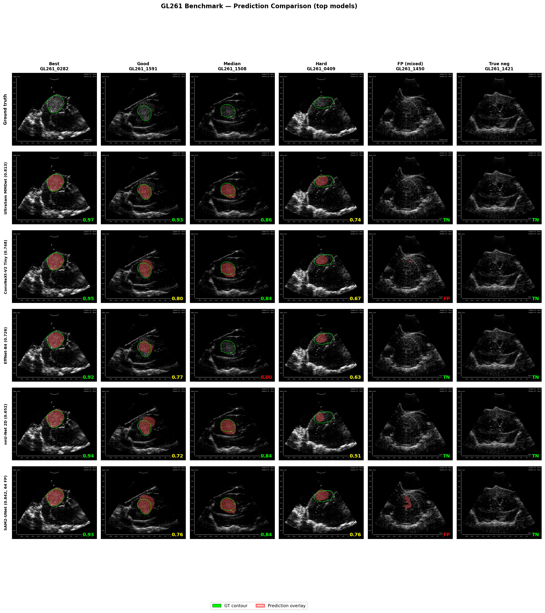

# GL261 Brain Tumor Segmentation Benchmark

First segmentation benchmark on the GL261 mouse brain ultrasound dataset.

## Dataset

The GL261 dataset (Dorosti et al., *Scientific Data*, 2025) contains
**B-mode ultrasound images** from **12 C57BL/6 mice**, acquired at **30 MHz** with a custom 64-element phased
array. Five annotators plus two expert reviewers produced consensus ground-truth
masks. Inter-rater Dice is 0.88--0.90.

- **Source:** Figshare, DOI [10.6084/m9.figshare.27237894](https://doi.org/10.6084/m9.figshare.27237894)
- **Paper:** Dorosti et al., *High-Resolution Ultrasound Data for AI-Based Segmentation in Mouse Brain Tumor.* Scientific Data 12, 1322 (2025).
  DOI [10.1038/s41597-025-05619-z](https://doi.org/10.1038/s41597-025-05619-z)

The original data descriptor provides no model baselines.

## Quickstart

```bash
pip install -e .

# Download dataset from Figshare
python download.py

# Prepare data (parse metadata, binarize masks, create nnU-Net layout)
python prepare.py

# Train SMP UNet with EfficientNet-B4 encoder
python train.py --encoder efficientnet-b4 --epochs 300 --aug-preset medical_v1 \
    --lr 1e-3 --encoder-lr-mult 0.1 --seed 42

# Evaluate (Dice, IoU, HD95, Surface Dice)
python evaluate.py --pred-dir checkpoints/predictions --model-name "EfficientNet-B4"
```

## Results

All results on the v2.1 validation set (352 images: 246 tumor-positive,
106 tumor-free). Models are fully automatic unless noted.

| Rank | Model | Encoder | Pretraining | T-Dice | O-Dice | FP/106 |
|-----:|-------|---------|-------------|-------:|-------:|-------:|
| 1 | UltraSam MMDet (mixed) | ViT-B | US-43d (282K US) | **0.837** | **0.849** | 13 |
| 2 | UltraSam MMDet (default) | ViT-B | US-43d | 0.813 | 0.830 | 14 |
| 3 | UltraSam UPerNet | ViT-B | US-43d | 0.799 | 0.777 | 29 |
| 4 | SMP UNet | ConvNeXt-V2 Tiny | FCMAE + IN-22k | 0.748 | 0.781 | 15 |
| 5 | UltraSam FPN (fine-tuned) | ViT-B | US-43d | 0.742 | 0.558 | 92 |
| 6 | SMP UNet | EfficientNet-B4 | ImageNet-1k | 0.726 | 0.755 | 19 |
| 7 | SAMUS (fine-tuned) | ViT-B | US30K (30K US) | 0.720 | 0.506 | 105 \* |
| 8 | SMP UNet (EMA\*\*) | EfficientNet-B4 | ImageNet-1k | 0.707 | 0.704 | 32 |
| 9 | USFM FPN | ViT-B | 2M clinical US | 0.668 | 0.703 | 23 |
| 10 | nnU-Net 2D | From scratch | None | 0.652 | 0.725 | 11 |
| 11 | SMP UNet | ResNet-34 | ImageNet-1k | 0.628 | 0.666 | 26 |
| 12 | Sam2Rad (Hiera-L + PPN) | Hiera-L | SA-1B | 0.499 | 0.619 | 11 |

**T-Dice** = Dice averaged over tumor-positive images only (primary metric).
**O-Dice** = Dice averaged over all images, including tumor-free (TN=1.0, FP=0.0).
**FP/106** = false positive count on 106 tumor-free images.

\* SAMUS cannot abstain: its prompt generator always produces prompts, even on
tumor-free images. High T-Dice but unusable standalone due to near-total FP.

\*\* EMA decay 0.9 with corrected checkpoint selection. Rank 6 used EMA decay
0.999 (always picked final epoch); the higher T-Dice there may reflect luck
rather than correct selection.

### Observations

- **Pretrained encoders help.** ImageNet-pretrained SMP UNets (0.628--0.748)
  mostly outperform nnU-Net 2D from scratch (0.652).
- **Decoder capacity matters.** Same UltraSam backbone: FPN (2M) 0.742,
  UPerNet (10M) 0.799, Mask2Former (40M+) 0.837.
- **Dataset mixing.** Adding BraTioUS human brain tumor US to training:
  0.837 vs 0.813 GL261-only. Marginal T-Dice benefit, but multi-dataset
  approaches are likely the right direction for small datasets.
- **US-specific pretraining is mixed.** UltraSam (282K clinical US) is the
  best encoder. USFM (2M clinical US) underperforms ImageNet baselines.
  Our tests are too limited to draw general conclusions about US pretraining.
- **Detection and segmentation are partially independent.** Sam2Rad achieves
  the lowest FP rate (11/106) but poor contours (T-Dice 0.499). Models that
  cannot abstain (SAMUS, UltraSam FPN) score well on T-Dice but fail on
  tumor-free images.
- **Seed variance is large.** ConvNeXt-V2 Tiny across 3 seeds: 0.596, 0.628,
  0.748 (std=0.065). Single-seed rankings should be treated with caution.

## Visual Examples



*Same six validation images shown for every model. Columns are selected by
Dice percentile on the top model: best, 90th, median, 25th percentile, plus
a tumor-free image that splits models (some hallucinate, others abstain) and
one where all models correctly predict empty. Green contour = ground truth,
red overlay = model prediction. Per-image Dice shown in the corner.*

## Reproducing Other Models

### UltraSam MMDet (T-Dice=0.837)

Requires [UltraSam](https://github.com/openmedlab/UltraSam) repo + MMDetection.
Key config: Mask2Former decoder, 1024px, COCO-format annotations.

```bash
pip install -e ".[coco]"     # installs pycocotools
python prepare_coco.py       # convert to COCO format + RGB
```

This produces COCO JSON annotations and 3-channel RGB PNGs in
`data/processed/coco/GL261/`. Point the UltraSam MMDetection config at the
generated annotation files and image directories. See upstream repo for
the Mask2Former training recipe.

### nnU-Net (T-Dice=0.652)

```bash
pip install nnunetv2
export nnUNet_raw="data/processed/nnunet"
export nnUNet_preprocessed="data/processed/nnunet_preprocessed"
export nnUNet_results="checkpoints/nnunet"
nnUNetv2_plan_and_preprocess -d 501
nnUNetv2_train 501 2d 0
```

### Sam2Rad (T-Dice=0.499)

Requires [Sam2Rad](https://github.com/aswahd/SamRadiology). Uses a Prompt
Predictor Network (PPN) on top of a frozen SAM2 Hiera-L encoder. Best
detection (11/106 FP) but poor contour quality. See upstream repo for
training details.

### SAMUS (T-Dice=0.720)

Requires [SAMUS](https://github.com/xianlin7/SAMUS). Fine-tuned with
adapter-only training (8.9M/142.2M params). Note: SAMUS cannot abstain on
tumor-free images (FP=105/106) and is not usable standalone without an
external detection gate.

## Evaluation Protocol

**Split (v2.1):** Mouse-level 2-way split. Train = 9 mice / 1,504 images.
Val = 3 mice / 352 images (M04 tumor in-vivo, M09 non-tumor in-vivo, M10
tumor ex-vivo). No image-level leakage.

**Primary metric: T-Dice.** Per-image Dice averaged over tumor-positive images.
This follows the nnU-Net / Metrics Reloaded convention for foreground-only
evaluation. All masks binarized at threshold 0.5.

**Secondary metric: O-Dice.** Per-image Dice averaged over all 352 images.
True negatives score 1.0; false positives score 0.0.

**Detection indicator: FP/106.** Count of tumor-free images where the model
predicts a non-empty mask.

## Citation

If you use this benchmark, please cite the original dataset paper:

> *High-Resolution Ultrasound Data for AI-Based Segmentation in Mouse Brain Tumor.*
> Dorosti et al., Scientific Data 12, 1322 (2025).
> DOI [10.1038/s41597-025-05619-z](https://doi.org/10.1038/s41597-025-05619-z)

## License

MIT
